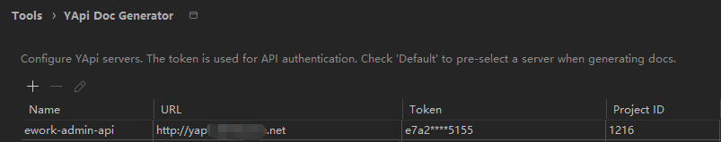
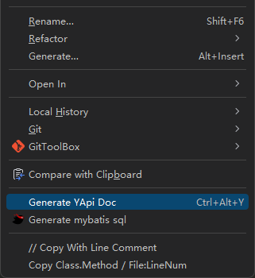
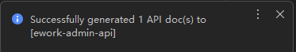
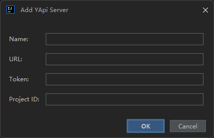

# YApi Doc Generator — IntelliJ IDEA Plugin

[](https://github.com/your-repo)
[](https://plugins.jetbrains.com)
[](https://adoptium.net)
[](https://gradle.org)

> **YApi Doc Generator** is an IntelliJ IDEA plugin that **automatically parses Spring MVC Controller classes and methods to generate YApi API documentation**.
>
> Say goodbye to the tedious work of manually writing and managing API documentation. One click converts your Controller code into well-structured YApi documentation.

---

## Table of Contents

- [Features](#features)
- [Installation](#installation)
- [Quick Start](#quick-start)
- [Usage Guide](#usage-guide)
  - [Configure YApi Server](#1-configure-yapi-server)
  - [Generate API Documentation](#2-generate-api-documentation)
  - [Server Auto-Matching](#3-server-auto-matching)
- [Screenshots](#screenshots)
- [Architecture](#architecture)
- [Development Guide](#development-guide)
- [License](#license)

---

## Features

### Smart Controller Detection
- Automatically identifies Controller classes via `@RestController` / `@Controller` annotations or `*Controller` naming convention

### Comprehensive Spring MVC Annotation Support
| Annotation | Support |
|------------|---------|
| `@RequestMapping` | ✅ Full support |
| `@GetMapping` | ✅ Full support |
| `@PostMapping` | ✅ Full support |
| `@PutMapping` | ✅ Full support |
| `@DeleteMapping` | ✅ Full support |
| `@PatchMapping` | ✅ Full support |

### Deep Request Parameter Parsing
- `@RequestParam` — Query parameter parsing
- `@PathVariable` — Path variable parsing
- `@RequestHeader` — Header parameter parsing
- `@RequestBody` — Recursive DTO parsing for request body

### Deep Recursive DTO Parsing
- Nested object fields (up to 10 levels of recursion)
- Generic type parameter resolution (e.g., `RestResult<T>` → `RestResult<User>`)
- Collection type support (`List`, `Set`, arrays)
- Enum type smart parsing
- Circular reference detection and termination
- Inherited field collection (including all parent class fields)
- `@JsonIgnore` annotated fields automatically skipped
- JSR-303 / Jakarta validation annotation recognition (`@NotNull`, `@NotBlank`, `@NotEmpty`)

### Automatic Response Body Parsing
- Method return types are automatically parsed into response structures, leveraging the same DTO parsing engine

### Smart Doc Title Extraction
- Prioritizes Swagger annotations `@ApiOperation` / `@Operation`
- Falls back to `ControllerTitle.methodName` format

### Automatic Category Management
- Automatically creates YApi categories based on the first segment of the URL path
- Creates non-existent categories on the fly

### Multi-Server Support
- Supports configuring multiple YApi servers
- **Auto-matching** by module name: fuzzy matches servers based on the module's root directory name
- Manual server selection dialog (when multiple servers are configured)

### Great User Experience
- Background async upload with progress indication
- Results delivered via Notification Balloon
- Friendly prompts when no server is configured
- Support for single method or entire class batch generation
- Shortcut: `Ctrl+Alt+Y`

---

## Installation

### Option 1: Install from JetBrains Marketplace (Recommended)
> **Coming soon** — stay tuned.

### Option 2: Manual Disk Installation
1. Download the latest `.jar` or `.zip` plugin package from [Releases](https://github.com/your-repo/releases)
2. Open IntelliJ IDEA, navigate to `File → Settings → Plugins`
3. Click the gear icon → `Install Plugin from Disk...`
4. Select the downloaded plugin package
5. Restart the IDE

### Option 3: Build from Source
```bash
# Clone the repository
git clone https://github.com/your-repo/yapi-idea-plugin.git

# Enter the project directory
cd idea-plugin

# Build the plugin
./gradlew buildPlugin

# Build output is located in build/distributions/
# Then follow Option 2 to install
```

---

## Quick Start

### 1. Configure YApi Server

Navigate to `File → Settings → Tools → YApi Doc Generator`, click the **+** button to add a server configuration:

- **Server Name**: A custom name (e.g., "Staging", "Production")
- **Server URL**: YApi service address (e.g., `https://yapi.example.com`)
- **Token**: Your YApi project token (found in YApi project settings)
- **Project ID**: The YApi project ID
- **Set as Default**: Check to make this the default server



### 2. Generate API Documentation

1. Open a Spring MVC Controller class in your project
2. **Generate a single endpoint**: Right-click on a method → `Generate YApi Doc`
3. **Generate the entire class**: Right-click on the class name → `Generate YApi Doc`
4. Alternatively, select the target and use the shortcut `Ctrl+Alt+Y`
5. If multiple servers are configured, a server selection dialog will appear
6. The plugin parses and uploads in the background — a notification will inform you of the result





---

## Usage Guide

### 1. Configure YApi Server

#### Adding a Server
Navigate to `Settings → Tools → YApi Doc Generator` to manage multiple server configurations:

| Action | Description |
|--------|-------------|
| **Add** | Click the **+** button and fill in server details |
| **Edit** | Double-click a table row or select it and click the edit button |
| **Delete** | Select a row and click the **-** button |

> **Note**: Tokens are masked in the table (`****`). You can view the full token when editing a server.



#### How to Get a Token
1. Log in to your YApi platform
2. Navigate to your project → `Settings → Token Configuration`
3. Copy the token and paste it into the plugin configuration

### 2. Generate API Documentation

#### Single Method
Right-click on a method in your Controller → `Generate YApi Doc`. Only the documentation for that specific method will be uploaded.

#### Entire Class
Right-click on the Controller class name → `Generate YApi Doc`. All methods annotated with Spring MVC annotations in the class will be uploaded.

#### Multi-Server Selection
When multiple servers are configured, a selection dialog will appear:
- If a server is set as **default**, it will be pre-selected
- If the module name can fuzzy-match a server, that server will be pre-selected
- You can manually switch the target server at any time


### 3. Server Auto-Matching

The plugin automatically matches servers based on **the root directory name of the current code module**. The matching rules are:

- Case-insensitive (e.g., `E-Work` ↔ `ework-backend-enterprise`)
- Separator-agnostic (underscores, hyphens, and spaces are treated equally)
- Fuzzy inclusion matching

**Example**: If the module root directory is named `e-work`, the plugin will automatically match a server whose name contains `ework`.

---

## Screenshots

> 📸 The following are placeholder paths — replace them with your actual screenshots.

| Scenario | Screenshot |
|----------|-----------|
| IntelliJ IDEA right-click menu |  |
| Settings configuration panel |  |
| Server edit dialog |  |
| Upload success notification |  |

---

## Architecture

### Module Responsibilities

```
┌─────────────────────────────────────────────────┐
│                   action Layer                    │
│          GenerateYApiDocAction                   │
│     IDEA right-click menu entry & shortcut       │
├─────────────────────────────────────────────────┤
│                   parser Layer                    │
│  ┌─────────────────┐  ┌───────────────────────┐  │
│  │SpringController │  │      DtoParser        │  │
│  │    Parser       │  │  DTO recursive parser │  │
│  │ Controller       │  │  nested·generics·     │  │
│  │ annotation parse │  │  collections·enums   │  │
│  └─────────────────┘  └───────────────────────┘  │
├─────────────────────────────────────────────────┤
│                   client Layer                    │
│                YApiClient                        │
│    Java HttpClient wrapper for YApi Open API     │
├─────────────────────────────────────────────────┤
│                   config Layer                    │
│  ┌─────────────┐  ┌──────────────────────────┐  │
│  │ YApiSettings │  │  YApiSettingsConfigurable│  │
│  │ Persistence  │  │  Settings UI entry point │  │
│  │ state mgmt   │  │                          │  │
│  └─────────────┘  └──────────────────────────┘  │
├─────────────────────────────────────────────────┤
│                    ui Layer                       │
│             ServerSelectDialog                   │
│           Server selection UI dialog             │
└─────────────────────────────────────────────────┘
```

### Core Classes

| Class | Package | Responsibility |
|-------|---------|---------------|
| `GenerateYApiDocAction` | `com.yapi.plugin.action` | Entry point, handles right-click menu events |
| `SpringControllerParser` | `com.yapi.plugin.parser` | Parses Spring MVC annotations and request mappings |
| `DtoParser` | `com.yapi.plugin.parser` | Recursively parses DTO fields into YApi-compatible format |
| `YApiInterfaceInfo` | `com.yapi.plugin.parser.model` | YApi API data model |
| `YApiClient` | `com.yapi.plugin.client` | YApi HTTP API client for document upload |
| `YApiSettings` | `com.yapi.plugin.config` | Persistent state component for settings |
| `YApiSettingsConfigurable` | `com.yapi.plugin.config` | Settings page entry |
| `YApiSettingsPanel` | `com.yapi.plugin.config` | Settings panel UI |
| `YApiServerConfig` | `com.yapi.plugin.config` | Server configuration data model |
| `ServerSelectDialog` | `com.yapi.plugin.ui` | Server selection dialog |

---

## Development Guide

### Tech Stack

| Component | Version |
|-----------|---------|
| Java | 17 |
| IntelliJ Platform | 2024.3 (IC) |
| Gradle | Kotlin DSL |
| Minimum Compatible Version | IntelliJ 2023.2+ (since-build 232) |
| JSON Processing | Google Gson 2.10.1 |

### Prerequisites

- IntelliJ IDEA 2023.2+ (Ultimate recommended for full Spring support)
- JDK 17+
- Gradle (use the included Gradle Wrapper)

### Common Commands

```bash
# Run an IntelliJ plugin development instance
./gradlew runIde

# Build the plugin package (output in build/distributions/)
./gradlew buildPlugin

# Clean build artifacts
./gradlew clean
```

### Project Structure

```
idea-plugin/
├── src/main/
│   ├── java/com/yapi/plugin/
│   │   ├── action/
│   │   │   └── GenerateYApiDocAction.java    # Right-click menu entry
│   │   ├── client/
│   │   │   └── YApiClient.java               # YApi HTTP client
│   │   ├── config/
│   │   │   ├── YApiServerConfig.java         # Server config model
│   │   │   ├── YApiServerEditDialog.java     # Add/edit server dialog
│   │   │   ├── YApiSettings.java             # Persistent settings
│   │   │   ├── YApiSettingsConfigurable.java # Settings entry
│   │   │   └── YApiSettingsPanel.java        # Settings panel UI
│   │   ├── parser/
│   │   │   ├── SpringControllerParser.java   # Controller annotation parser
│   │   │   ├── DtoParser.java                # DTO recursive parser
│   │   │   └── model/
│   │   │       └── YApiInterfaceInfo.java    # API data model
│   │   └── ui/
│   │       └── ServerSelectDialog.java       # Server selection dialog
│   └── resources/META-INF/
│       └── plugin.xml                        # Plugin registration config
├── screenshots/                              # Screenshot resources
├── build.gradle.kts                          # Gradle build script
├── settings.gradle.kts
├── README.md
└── README.en.md
```

### Debugging Tips

1. Use `./gradlew runIde` to start a debug instance
2. Set breakpoints in the plugin code for debugging
3. Log output can be viewed in the IDE's `Event Log` and notification popups
4. To adjust the minimum compatible version, modify `<idea-version since-build="232"/>` in `plugin.xml`

---

## License

```
Copyright (c) 2024

Licensed under the Apache License, Version 2.0 (the "License");
you may not use this file except in compliance with the License.
You may obtain a copy of the License at

    http://www.apache.org/licenses/LICENSE-2.0

Unless required by applicable law or agreed to in writing, software
distributed under the License is distributed on an "AS IS" BASIS,
WITHOUT WARRANTIES OR CONDITIONS OF ANY KIND, either express or implied.
See the License for the specific language governing permissions and
limitations under the License.
```

---

> **Tip**: All screenshot paths in this document are placeholders. Please place your actual screenshots in the `screenshots/` directory.
>
> If you encounter any issues, feel free to submit an [Issue](https://github.com/your-repo/issues) or Pull Request.
